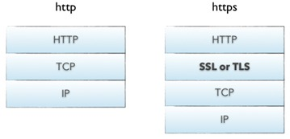
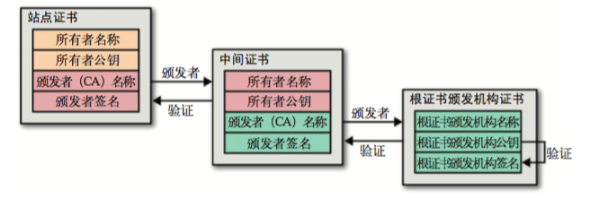

# HTTP/1.0  /1.1  /2.0 及 HTTPS 介绍和比较 

> 本文先比较了 HTTP 协议的 1.0、1.1、2.0 版本的异同，介绍了 HTTP 协议的发展。后部分介绍了基于 HTTP + SSL/TLS 的 HTTPS协议，梳理了应用层协议 HTTP 的发展。

在[介绍 TCP 协议的文章](/tech/tcp "介绍 TCP 协议的文章")中，我们介绍了 TCP／IP 协议族的分层：

	| 应用层 （如HTTP、FTP、TELNET）|
	|---------------------------------|
	| 运输层 （TCP或UDP） |
	| 网络层 （IP） |
	| 网络接口层 （如Ethernet）|

本文将详细介绍应用层协议 HTTP，以及由此发展出的 HTTPS 协议。

回顾一下，在运输层的 TCP 协议，是基于字节流的、可靠的、面向连接的协议。在 TCP 层是不会对字节流的数据做解释的，数据的组成方式及长度划分都是在 HTTP 协议层级完成的，因此一个 HTTP 通信数据可能由多个 TCP 通信完成，一个 TCP 通信里也可能包含多个 HTTP 请求的数据。

## HTTP 协议

HTTP协议是Hyper Text Transfer Protocol（超文本传输协议）的缩写,是用于从万维网（WWW:World Wide Web ）服务器传输超文本到本地浏览器的传送协议。

### 特点

1. **简单快速**：
协议简单，只需指定请求路径和请求方式。因此HTTP服务器的程序简单，通信速度快。

2. **灵活**：
可传输多种类型的数据，在协议头 Content-Type 中说明类型。

3. **无连接**：每次连接只处理一个请求，返回结果后就断开。可节省传输时间。

4. **无状态**：是指协议对于事务处理没有记忆能力，各个请求独立。

### 协议请求规范

HTTP使用统一资源标识符（Uniform Resource Identifiers, URI）来传输数据和建立连接。URL（uniform resource locator）是一种特殊类型的URI，包含了用于查找某个资源的足够的信息。

HTTP Request 请求格式如下：

Response 的格式与上面类似，只是第一行由请求方法和状态码构成。

关于 HTTP 协议的内容就不再展开了，接下来我们重点看一下 HTTP 1.0，HTTP 1.1 和 HTTP 2.0 的差异。

## HTTP 的优化

随着 Web 2.0 和移动端的发展，网络情况变得越来越复杂，资源种类也越来越多，于是人们开始了对于 HTTP 协议的不断优化。

### 影响因素

影响一个 HTTP 网络请求的因素主要有两个：**带宽**和**延迟**。

- **带宽**：是指单位时间内可以传输的信息量，即bit数。带宽主要跟信号传输介质有关，随着光纤等材料的发展，带宽已经是不影响请求的瓶颈了。

- **延迟**：
	- 浏览器阻塞：浏览器会因为一些原因阻塞请求，比如对于同个域名，同时只能有4个连接，超过限制的请求会被阻塞；
	- DNS查询：将域名解析为IP，可通过DNS缓存优化；
	- 建立连接：HTTP请求基于 TCP，浏览器最快也要在第三次握手时才能捎带 HTTP 请求报文。三次握手在高延迟场景下影响较明显，慢启动则对文件类大请求影响较大。
	

### HTTP 1.1 vs HTTP 1.0

相比 1.0，1.1主要有以下几个发展：

1. **支持长连接** （Header：Connection）

	HTTP 1.0 规定每次服务端发回 Response 之后，就断开 TCP 连接，下一次请求又需要重新建立 TCP 连接，显然这样会增加连接建立和断开的成本，造成带宽浪费和延迟。

	> HTTP 1.0 的协议规范中说明，在实现服务端的 TCP 时，需要注意，在关闭 TCP 连接之前，最好确定客户端是否收到了关闭连接前的最后一个包。如果服务端关闭连接后，客户端还在发送数据（TCP的重试），服务端需要发送一个 reset 包给客户端，告知其使用的 TCP 连接已经失效，需清空这个连接收到的缓存数据。

	1.1 中规定，多个 HTTP 请求可共享一个 TCP 连接，通过协议头中的 Connection=keep-alive 默认开启。当浏览器完成请求资源时，将 Connection 字段置为 close，即通知服务器完成本次请求后关闭连接。
	
	例如：一个包含有许多图像的网页文件的多个请求和应答可以在一个连接中传输，但每个单独的网页文件的请求和应答仍然需要使用各自的连接，这就是所谓的 pipelining 。

	但是这其实也不能很好地解决多路复用的问题，如果一个请求数据过大或者速度慢，会阻塞后面的请求。

2. **增加 HOST 头域** （Header：HOST）

	在HTTP1.0中认为每台服务器都绑定一个唯一的IP地址，因此，请求消息中的URL并没有传递主机名（hostname）。但随着虚拟主机技术的发展，在一台物理服务器上可以存在多个虚拟主机（Multi-homed Web Servers），并且它们共享一个IP地址。

 HTTP1.1的请求消息和响应消息都应支持Host头域，且请求消息中如果没有Host头域会报告一个错误（400 Bad Request）。此外，服务器应该接受以绝对路径标记的资源请求。

3. **带宽优化**

	###### 支持请求资源的某部分 （Header：range）

	1.1 中增加了一个 range 的请求头，它允许只请求资源的某个部分。在响应消息中Content-Range头域声明了返回的这部分对象的偏移值和长度。如果服务器相应地返回了对象所请求范围的内容，则响应码为206（Partial Content），它可以防止Cache将响应误以为是完整的一个对象。这个功能可让浏览器只请求资源需要的部分，同时支持了**断点续传**。

	###### 只发送header （101状态码）
	
	HTTP/1.1加入了一个新的状态码100（Continue）。客户端事先发送一个只带头域的请求，如果服务器因为权限拒绝了请求，就回送响应码401（Unauthorized）；如果服务器接收此请求就回送响应码100，客户端就可以继续发送带实体的完整请求了。 

4. **消息传递** （Header：Chunkedtransfer-coding）

	HTTP消息中可以包含任意长度的实体，通常它们使用 Content-Length来给出消息结束标志。但是，对于很多动态产生的响应，只能通过缓冲完整的消息来判断消息的大小，但这样做会加大延迟。如果不使用长连接，还可以通过连接关闭的信号来判定一个消息的结束。
	
	HTTP/1.1中引入了 Chunkedtransfer-coding 来解决上面这个问题，发送方将消息分割成若干个任意大小的数据块，每个数据块在发送时都会附上块的长度，最后用一个零长度的块作为消息结束的标志。这种方法允许发送方只缓冲消息的一个片段，避免缓冲整个消息带来的过载。
	
5. **缓存** （Header：Cache-Control）

	1.1 优化了缓存机制，使其更灵活。比如加入了 Cache-Control 头，它支持一个可扩展的指令子集：例如 max-age 指令支持相对时间戳；private和no-store指令禁止对象被缓存。
	
6. **其他**

	除了以上5点，1.1还有很多扩展，比如新增了24个状态响应码，如409（Conflict）表示请求的资源与资源的当前状态发生冲突；410（Gone）表示服务器上的某个资源被永久性的删除，等等。
	
	同时，考虑到向上兼容，1.1 规定可以在头部加一个 Upgrade 字段，允许浏览器将请求升级为其他服务端支持的协议，如 websocket。

	

### HTTP 2.0 vs HTTP 1.1

相比1.0，2.0又有以下的优化。

1. **支持多路复用** （Multiplexing）

	HTTP 1.1 在同一时间对于同一个域名的请求数量有限制，超过限制就会阻塞请求。同时，若干个请求排队串行化单线程处理，后面的请求等待前面请求的返回才能获得执行机会，一旦有某请求超时等，后续请求只能被阻塞。

	多路复用底层采用**增加二进制分帧层**的方法，使得不改变原来的语义、首部字段的情况下提高传输性能，降低延迟。如下图所示。

	二进制分帧将所有传输信息分割为更小的帧，用二进制进行编码，多个请求都在同一个TCP连接上完成，可以承载任意数量的双向数据流。HTTP/2 更有效的使用TCP连接，得到性能上的提升。

	要分帧，就涉及到帧流控制和优先级控制。一个request对应一个id，这样一个连接上可以有多个request，每个连接的request可以随机的混杂在一起，接收方可以根据request的 id将request再归属到各自不同的服务端请求里面。同时，为了不阻塞重要的请求，对于不同的请求，也有优先级的划分。

2. **支持压缩header**

	2.0 支持头部压缩，采用HPACK算法。
	
	头块必须被发送作为帧的连续序列，以及任何其他类型，或者通过任何其他流的无交插帧。

3. **支持服务端推送**

	当浏览器请求一个网页时，服务器将会发回HTML，在服务器开始发送JavaScript、图片和CSS前，服务器需要等待浏览器解析HTML和发送所有内嵌资源的请求。服务器推送服务通过“推送”那些它认为客户端将会需要的内容到客户端的缓存中，以此来避免往返的延迟。
	
### 总结

HTTP／1.1 在 1.0 的基础上通过长连接来减小 TCP 连接维护的成本，一定程度上优化了延迟问题，但其所采用的有序阻塞的 pipelining 仍然没能完全实现复用 TCP 连接的目的，而 2.0 通过增加一个二进制帧，真正实现了多路复用，提高了带宽的利用率，有效优化了延迟问题。

	

## HTTPS 协议

HTTP 协议传输的数据都是未加密的，也就是明文的，因此使用 HTTP 协议传输隐私信息非常不安全，为了保证这些隐私数据能加密传输，于是网景公司设计了SSL（Secure Sockets Layer）协议用于对 HTTP 协议传输的数据进行加密，从而就诞生了 HTTPS。简单来说，HTTPS协议是由 HTTP + SSL/TLS 协议构建的可进行加密传输、身份认证的网络协议，要比 HTTP 协议安全。

### SSL协议和TLS协议

#### SSL 协议
SSL协议位于 TCP/IP 协议与各种应用层协议之间，为数据通讯提供安全支持。SSL协议可分为两层：SSL记录协议（SSL Record Protocol）：它建立在可靠的传输协议（如TCP）之上，为高层协议提供数据封装、压缩、加密等基本功能的支持。SSL握手协议（SSL Handshake Protocol）：它建立在SSL记录协议之上，用于在实际的数据传输开始前，通讯双方进行身份认证、协商加密算法、交换加密密钥等。

#### TLS 协议
TLS（Transport Layer Security，传输层安全）：其前身是 SSL，它最初的几个版本（SSL 1.0、SSL 2.0、SSL 3.0）由网景公司开发，1999年从 3.1 开始被 IETF 标准化并改名，发展至今已经有 TLS 1.0、TLS 1.1、TLS 1.2 三个版本。SSL3.0和TLS1.0由于存在安全漏洞，已经很少被使用到。目前使用最广泛的是TLS 1.1、TLS 1.2。

### 握手过程

首先客户端向服务端发起 HTTPS 请求，告诉服务器 SSL 协议的版本号，以及支持的加密套件等信息。

服务端会返回一个 SSL 证书。客户端拿到证书后，校验证书的有效性。如果无效，显示“无效的证书”提示；如果有效，取出证书中的公钥。

客户端生成一个随机数，再用证书中的公钥将随机数进行加密，发送给服务端。

服务端使用证书对应的私钥解密，获得客户端的随机数。

之后，双方使用这个随机数作为公钥，通过对称加密将通信内容进行加密。

### 证书验证

**如何验证一个证书是否有效呢？**

首先，我们要了解**数字签名**的概念。

证书颁发者用自己的私钥将证书的摘要信息进行加密，生成数字签名。拿到证书的人，可以用该颁发者公开的公钥进行解密得到数字签名中的摘要，再与计算得到的证书的摘要对比，如果一致，说明改证书确实由宣称这个公钥的颁发者提供的，没有被篡改过。因为私钥只有证书颁发者自己知道，所以数字签名也是不能被伪造的。

证书中一般会包含如下信息：

- 证书颁发机构信息
- 证书持有者的身份信息（网址、IP等）
- 证书拥有者对应的加密通信内容的公钥
- 证书颁发机构生成数字签名的算法（便于通过生成摘要校验证书有效性）

同时，拿到证书的服务端，会保存该证书的私钥，绝对不能泄露。

**验证证书链有效性**

根证书是预先安装在操作系统中的，被浏览器信任。同时，根证书也是自签名的。

根证书会颁发一些中间证书，中间证书再给站点颁发证书。在验证站点证书有效性时，需验证整个证书颁发链，保证每个证书都有效。

1. 在拿到站点的证书时，首先要在证书中找到颁发者的信息，找到颁发者的证书，从中获取颁发者的公钥；然后用颁发者的公钥验证站点证书是否有效。

2. 如果有效，且颁发者是中间证书，就需要再用更上一层根证书颁发者的公钥来验证中间证书的有效性;

3. 根证书预先安装在操作系统中，是被浏览器信任的。

在验证一个证书未必篡改且由信任机构颁发的之后，还需要验证以下几点：

- 证书是否过期
- 证书的网站域名是否与部署此证书的网站域名一致
- 通过检查颁发机构的证书吊销列表（或有效证书列表），看此证书是否已经被吊销

所有信息验证无误后，客户端再取证书中的公钥，继续加密通信。

### HTTPS vs HTTP

#### 优势

1. 所有信息传播都是加密的，第三方没有证书的私钥，也就无法知道用于加密请求的公钥；
2. 通过证书可验证颁发者的身份，且能放篡改，保证持有证书的对话方是可信任的；
3. 请求无法被篡改，也无法被伪造。

#### 缺点
1. SSL 证书需要花钱，证书在服务器上的部署、更新、维护也很繁琐；
2. HTTPS 需要多次握手，会造成一定的延迟；
3. HTTPS 涉及到加密运算，会消耗机器 CPU 资源；
4. 证书的有效性有时难以保障，比如一些中间证书会给一些并不安全的站点颁发站点证书。	 	

